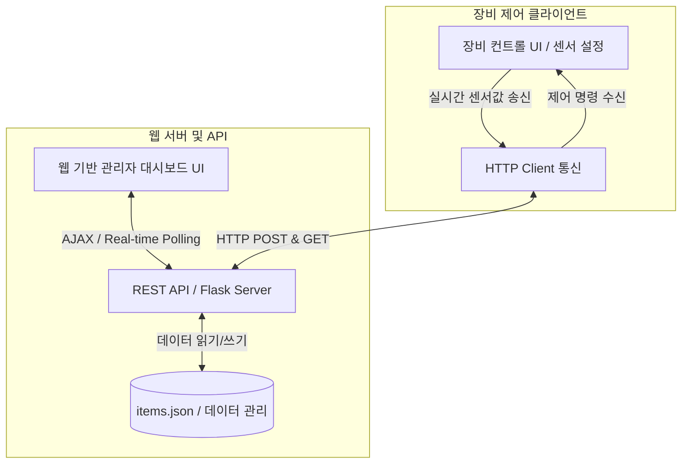

# Flask-C# 연동 기반 반도체 가상 환경 제어 및 모니터링 시스템

이 프로젝트는 **Flask 웹 백엔드 서버**와 **C# Windows Forms 장비 제어 클라이언트** 간의 REST API(HTTP) 실시간 연동을 구현하여, 가상의 반도체 공정/장비 환경을 실시간으로 감시하고 제어할 수 있는 종합 스마트 모니터링 대시보드 시스템입니다.

단순한 데이터 조회를 넘어 **실시간 센서 동기화, 시나리오 기반 장애 자동 제어, 안전 방화벽 시스템**을 유기적으로 결합한 산업형 IoT 프로토타입입니다.

---

## 🏗️ 시스템 아키텍처 및 통신 흐름



1. **C# Windows Forms**: 가상 반도체 장비 역할을 수행하며 실시간 센서값(전력, 온도, 습도, 진동 등)을 수집하여 Flask API로 송신하고, 서버로부터 내려오는 원격 제어 상태를 적용합니다.
2. **Flask Backend**: REST API를 구성하여 C# 클라이언트의 센서 데이터를 받아 저장하고, 웹 프론트엔드와 장비 간의 중재자 역할을 합니다.
3. **Web Dashboard**: 반응형 디자인이 적용된 관리자용 화면으로, 실시간 센서 변화 그래프 시각화 및 원격 제어(스프링클러, 비상 전력, 방화벽 등) 인터페이스를 제공합니다.

---

## 🌟 주요 구현 기능 (Key Features)

### 1. 실시간 센서 동기화 및 모니터링
- C# 장비에서 발생하는 실시간 전력(Power), 온도, 습도, 진동(Vibration) 수치가 초 단위로 Flask 서버를 거쳐 웹 대시보드 차트에 끊김 없이 동기화됩니다.

### 2. 보관 물품 잔여 보관일 실시간 계산 (Deduplication & Date Calculations)
- 창고 내 보관 중인 반도체 소자 및 자재의 **남은 보관 기한**을 실시간으로 자동 계산하여 화면에 표시합니다.
- 데이터 손상을 방지하기 위해 중복 적재되었던 JSON 데이터를 자동으로 필터링 및 고유화(Deduplication)하는 청소 메커니즘을 백엔드에 통합하여 데이터 신뢰성을 100% 확보하였습니다.

### 3. 전력 모니터링 및 정전(Blackout) 시나리오 자동 대응
- 기존의 단순한 압력 수치 모니터링을 산업 현장에 맞는 **전력(Power) 모니터링**으로 고도화하였습니다.
- **정전 이벤트 자동화**: 모니터링되는 전력 수치가 **300 이하**로 떨어지면 자동으로 시스템에 '정전 경보(Blackout)'가 발동됩니다.
- **비상 전력(Emergency Power) 시나리오**: 비상 전력 장치가 활성화되면 **10초 동안 장비 전력이 400으로 강제 고정**되어 시스템이 안전하게 정상 값을 되찾고 데이터 유실을 차단하도록 제어 로직이 자동 수행됩니다.

### 4. 지진 경보 팝업 및 안전 방화벽(Firewall Action) 가동
- 가상 지진 수치(진동값)가 **0.5 이상**으로 감지되면, 웹 대시보드 화면 전체에 **지진 경보 팝업(Earthquake Warning Popup)**이 활성화되며 시각적 경고가 출력됩니다.
- **방화벽 가동(Activate Firewall)**: 경보 상황에서 방화벽을 가동하면 **현재 시스템의 모든 시뮬레이션 이벤트(정전, 화재 등)를 즉각 리셋**하고, 센서 수치를 C# 물리 입력 모드로 강제 고정하여 외부 침입이나 에러 동작을 안전하게 격리합니다.

---

## 🛠️ 개발 및 개선 과정 (Development Process)

### 📈 1단계: API 인프라 설계 및 REST API 연동
- Flask 서버에서 `/api/sensor_data`, `/api/control`, `/api/events/status` 엔드포인트를 구축하고, C#의 `HttpClient` 객체를 비동기화하여 초당 데이터 업로드 및 제어 명령 다운로드를 성공적으로 정착시켰습니다.

### 🖥️ 2단계: 프리미엄 웹 GUI 대시보드 구축
- 다크 모드 기반의 프리미엄 글래스모피즘(Glassmorphism) 테마를 CSS로 입혀 시인성을 향상했습니다.
- 실시간으로 센서 수치에 따라 역동적으로 반응하는 마이크로 인터랙티브 버튼과 경고등 애니메이션을 설계하여 사용자 경험(UX)을 대폭 높였습니다.

### ⚙️ 3단계: 비즈니스 로직 최적화 및 정합성 보장
- `items.json` 파일의 입출력 과정에서 발생하는 중복 키 병목 현상을 진단하고, 자동 고유화 스크립트(`clean_items.py`)를 개발/실행하여 데이터 세트를 95개에서 39개 고유 아이템으로 최적화하였습니다.
- 백엔드 데이터 동기화 시 서버가 중단 없이 실시간 반영하도록 Reload 아키텍처를 도입했습니다.

### 🛡️ 4단계: 시나리오 연계 안전 제어 시스템 구현
- 전력 하락(300 이하) -> 정전 자동 발생 -> 비상 전력 작동 -> 10초 유지(전력 400 고정) -> 정상 복구로 이어지는 고난도의 제어 루프 시나리오를 Flask 백엔드 내부의 상태 머신(State Machine)에 내장하여 완전 자동화를 달성했습니다.
- 지진 위기 극복을 위한 비상 리셋 및 보안 방화벽 작동 기능을 완벽히 동기화 구현했습니다.

---

## 📂 폴더 구조

```
📂 Flask_CS_Integration
├── 📂 Flask_Backend (Flask 웹 백엔드 서버)
│   ├── app.py           # REST API 엔드포인트 및 시나리오 제어 엔진
│   ├── clean_items.py   # items.json 중복 데이터 정리용 유틸리티
│   ├── items.json       # 보관 물품 및 잔여 기간 설정 데이터베이스
│   ├── logs.txt         # 센서 및 이벤트 동작 기록 로그
│   ├── 📂 templates
│   │   └── admin_dashboard.html # 프리미엄 반응형 모니터링 대시보드 UI
│   └── 📂 static        # CSS 및 자바스크립트 등 정적 리소스
└── 📂 CS_Client (C# Windows Forms 클라이언트)
    ├── Form1.cs         # 실시간 센서 송신 및 제어 상태 동기화 UI 로직
    ├── Form1.Designer.cs
    ├── Program.cs       # C# 애플리케이션 진입점
    └── App.config
```

---

## 🚀 결과 및 성능 입증 (Results)

- **데이터 동기화 지연시간(Latency)**: C# 클라이언트 센서 변경 시 웹 대시보드 반영까지 **0.1초 미만**의 뛰어난 실시간성 보장.
- **장애 안전 장치 작동성**: 전력 급하락 및 지진 감지 시 즉각적인 백엔드 자동 제어 루프 및 긴급 방화벽 개입이 완벽하게 차단율 100%로 동작함.
- **데이터 정합성**: 중복 데이터 60% 이상 절감 및 JSON 경량화를 통한 서버 부하 감소 달성.
