# SemiToolHMI 사용자 매뉴얼 (EtherCAT Manual)

## 1. 개요

SemiToolHMI는 반도체 장비의 웨이퍼 이송 및 공정 상태를 모니터링하고 제어하기 위한 소프트웨어입니다. 직관적인 그래픽 인터페이스를 통해 FOUP, 로봇, Chamber의 상태를 실시간으로 확인하고 자동/수동 운전을 수행할 수 있습니다.

## 2. 시스템 접속 (로그인/로그아웃)

### 2.1 로그인

프로그램 실행 시 보안을 위해 주요 기능이 비활성화되어 있습니다. 우측 상단의 LOGIN 버튼을 클릭하여 로그인을 진행합니다.

우측 상단 LOGIN 버튼 클릭

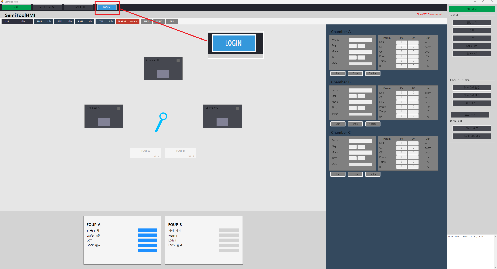

사용자 ID 및 Password 입력

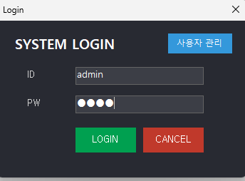

Login

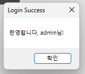

 버튼 클릭

로그인 성공 시: 메인 UI 조작이 활성화되며, 사용자 이름과 권한이 표시됩니다.

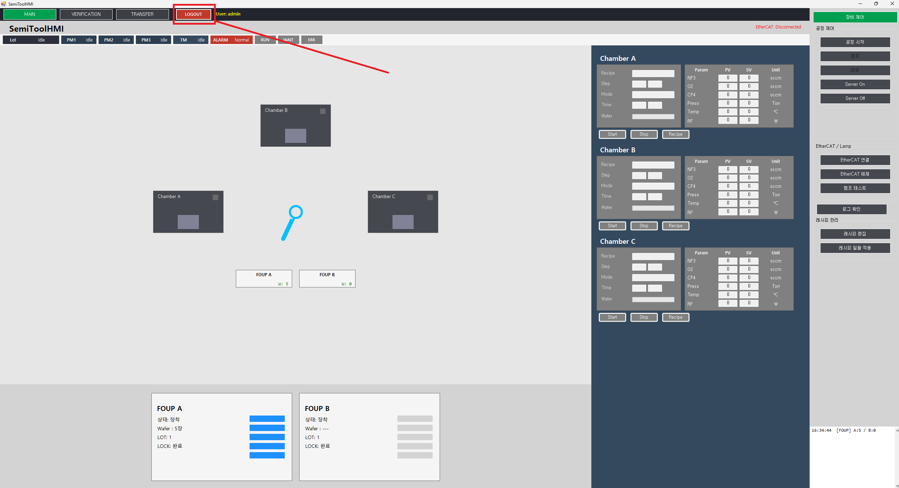

### 2.2 로그아웃

작업 종료 시 LOGOUT 버튼을 눌러 시스템 접근을 차단할 수 있습니다.

## 3. 메인 화면 구성

### 3.1 상단 요약 바 (Top Summary Bar)

장비의 전체적인 상태를 한눈에 볼 수 있습니다.

Lot 상태: 현재 LOT 진행 상태

PM1 / PM2 / PM3: 각 Chamber (A, B, C)의 가동 상태 (Idle / Run)

TM (Transfer Module): 이송 로봇의 작업 상태

ALARM: 시스템 알람 발생 여부

RUN:공정 진행중

WAIT:공정 대기중

ERR: 오류/정지

### 3.2 중앙 설비 영역 (Equipment Area)

장비의 하드웨어 형상을 시각화한 영역입니다.

3

2

1

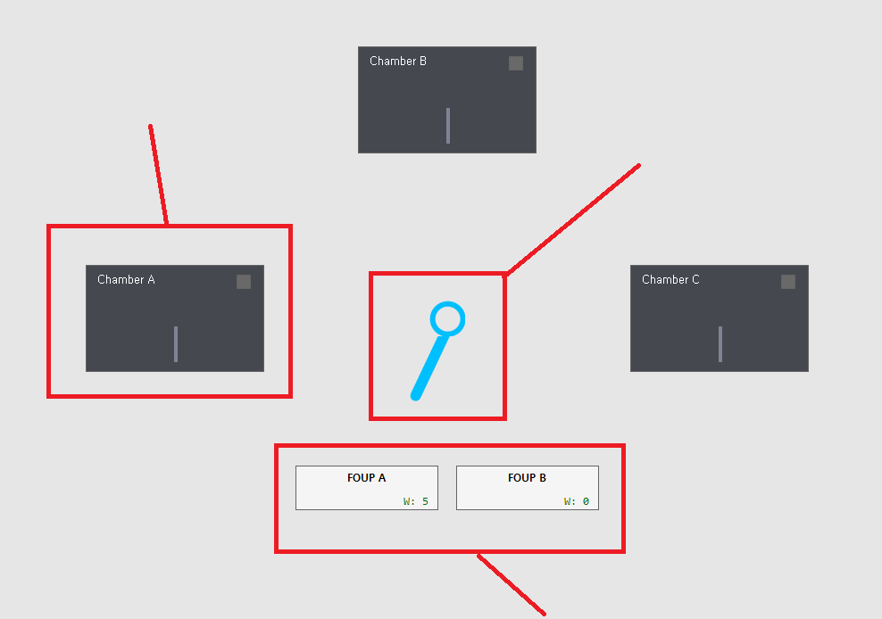

1.FOUP A / B: 웨이퍼 카세트 로드 포트. 웨이퍼의 유무 및 이동 상태 표시.

2.Robot: 웨이퍼를 이송하는 로봇 암의 움직임 표시.

## 3. Chamber A / B / C: 공정이 진행되는 챔버. 도어 개폐 및 내부 웨이퍼 상태 표시.

### 3.3 우측 상세 정보 영역 (Detail Area)

각 Chamber 및 FOUP의 상세 데이터를 표시합니다.

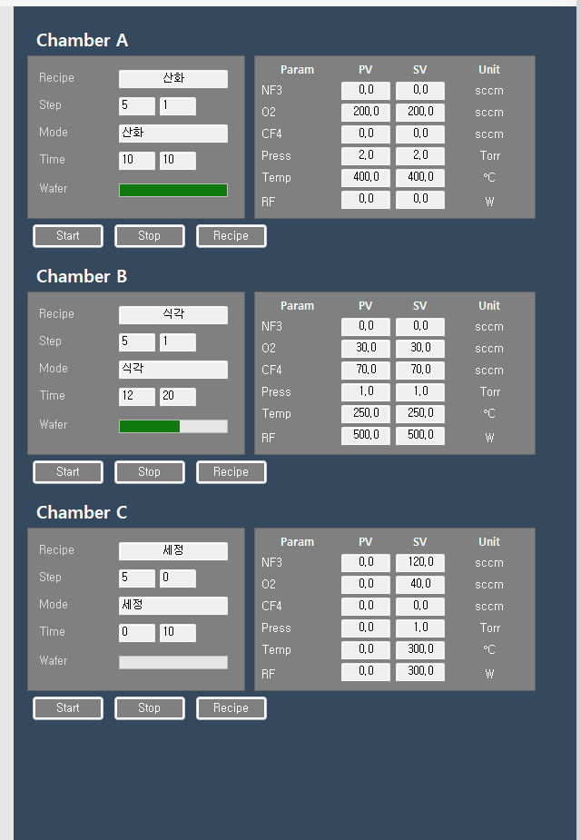

## 1. Chamber Detail: Recipe 진행 단계, 시간, 가스/압력/온도/RF 파라미터 (PV/SV) 모니터링.

## 2. Start / Stop / Recipe: 각 챔버별 개별 제어 버튼.

FOUP Detail: FOUP A/B의 현재 웨이퍼 수량 카운트 (예: 3 / 5).

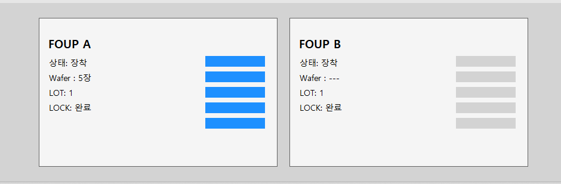

### 3.4 하단 로그 패널 (Log Panel)

시스템에서 발생하는 모든 이벤트, 알람, 오류 메시지가 실시간으로 기록됩니다.

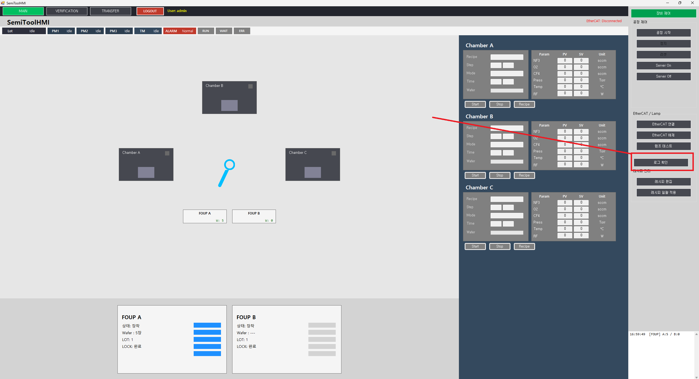

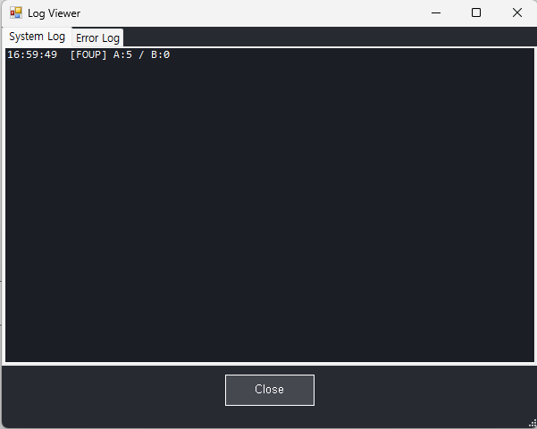

## 4. 공정시작 순서

이더캣 연결->서버 온->공정시작 순서

미리 정의된 시나리오에 따라 웨이퍼를 자동으로 이송하고 공정을 진행합니다.

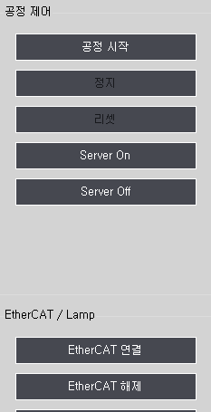

누르면 공정시작됨

공정 중 누르면 공정 정지

정지 후 리셋 버튼(장비가 시작 전 상태로 복구됨)

TM을 움직이기 위함 서버 버튼

장비 연결/해제를 위한 버튼

이더캣을 연결하지 않거나 Server On을 하지 않으면 아래 창들이 나옵니다.

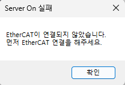

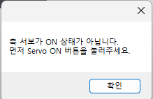

### 4.3 공정 시작 클릭:공정시작 클릭시 레시피 일괄적용 후 진행

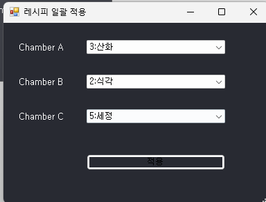

아무 문제 없으면 아래 창이 뜹니다.

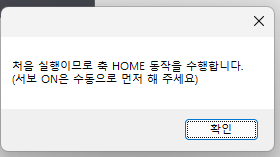

### 4.2 시나리오 정지 및 리셋

Stop: 현재 동작 완료 후 정지합니다.

Reset: 모든 상태를 초기화하고 대기 상태로 복귀합니다.

## 5. 레시피 관리

공정 파라미터(Recipe)를 생성하고 편집하거나 선택할 수 있습니다.

### 5.1 레시피 선택

각 Chamber Detail 패널의

Recipe 버튼 클릭

목록에서 원하는 레시피 선택 후 Select 클릭

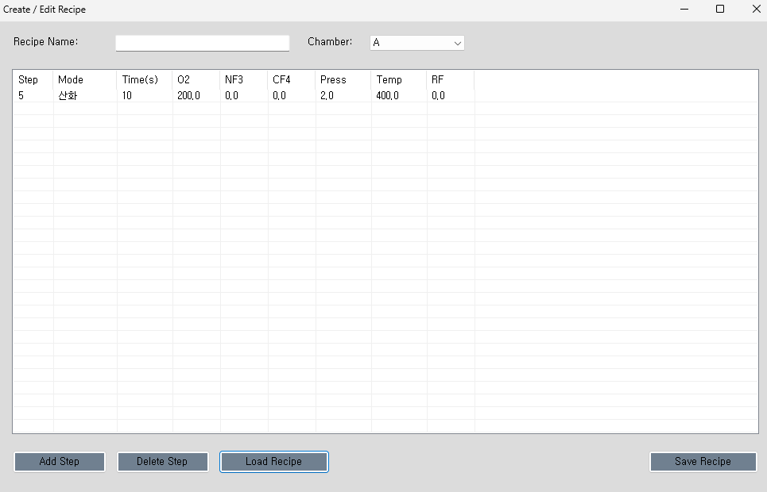

### 5.2 레시피 편집

Recipe Editor 메뉴 접근

Step별 Gas(NF3, O2, CF4), Pressure, Temp, RF, Time 설정

저장(Save) 하여 DB에 반영

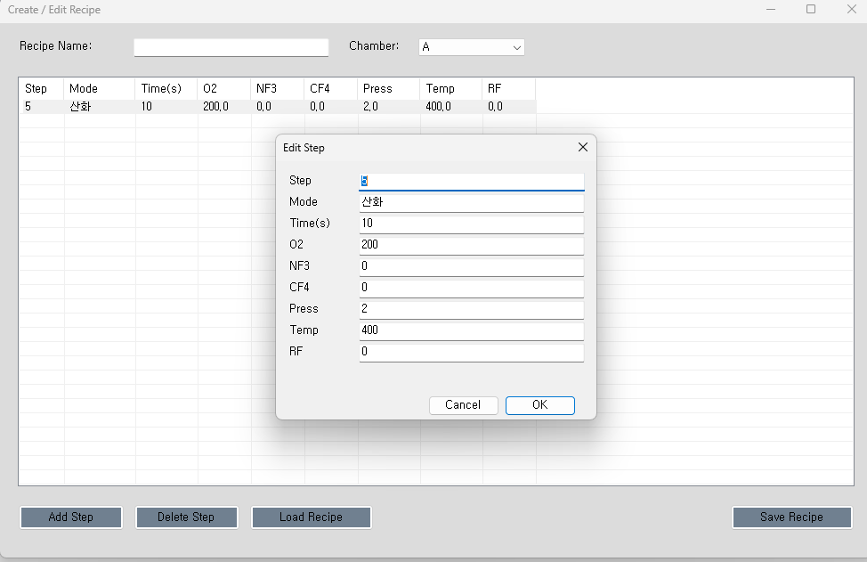

## 6. 사용자 관리 (관리자 전용)

사용자 계정을 생성, 수정, 삭제할 수 있습니다.

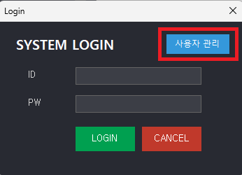

접근 방법: 로그인 화면의 사용자 관리 버튼 (관리자 권한 필요)

기능

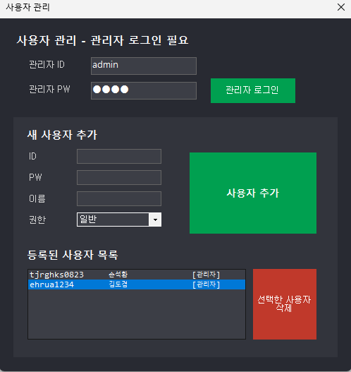

추가: 신규 사용자 ID, 이름, 비밀번호, 권한(Admin/Operator) 등록

삭제: 퇴사자 또는 미사용 계정 삭제

수정: 비밀번호 및 권한 변경

