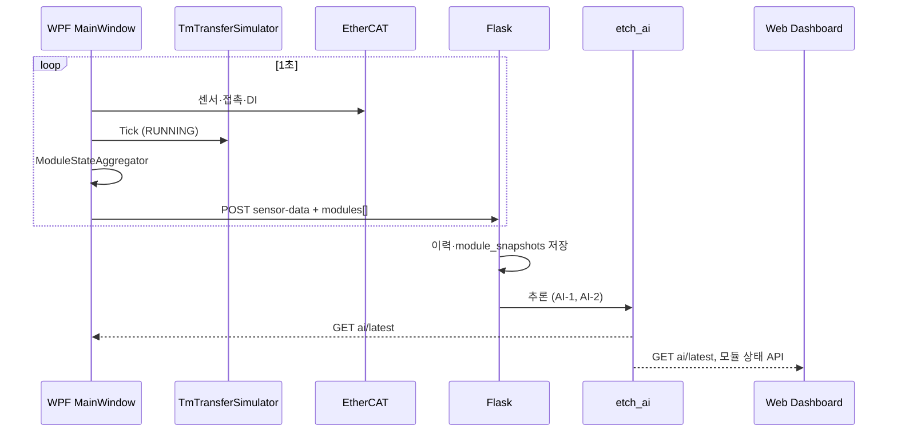

# 모듈별 상태 모니터링 + AI(이상·알람) 통합 계획

> **기준 문서:** [`PROJECT_계획.md`](PROJECT_계획.md)  
> **참고 UI:** 클러스터 툴 평면도 (EFEM · Load Port 1~3 · Aligner · BM · TM · PM1~4)  
> **목적:** 실장비 제어/확인 → 웹 모니터링 → 데이터 축적 → AI 학습·추론. **모듈마다 Run/Standby 등 상태를 따로 본다.**

---

## 1. 목표 정리

| 계층 | 역할 | AI와의 관계 |
|------|------|-------------|
| **WPF** | 장비 제어, 인터락, 레시피/임계치(관리자), **모듈 상태 표시** | AI **조언만** 표시 |
| **Flask** | 이력 저장, **모듈 스냅샷**, AI 학습·추론 | AI **엔진** |
| **웹** | 전체 라인 모니터링, 모듈별 상태·AI 결과·학습 운영 | 분석·재학습 트리거 |

**AI 2트랙 (둘 다 진행):**

| 트랙 | 이름 | 운전 중 출력 | 학습 목표 |
|------|------|--------------|-----------|
| **AI-1** | 이상 탐지 (Anomaly) | 이상 점수 0~1, “정상 패턴 이탈” | 정상 구간 vs 이상 구간(알람 전후 포함) |
| **AI-2** | 알람 예측 (Alarm Predict) | 예상 알람 코드·확률, 권고 조치 | A001~A006 등 **다음/동시 알람** 분류 |

공통 원칙: **AI는 인터락·Start/Stop·램프·도어를 직접 제어하지 않는다.**

---

## 2. 참고 UI → etch_ui 매핑

참고 그림은 **풀 클러스터(EFEM + BM + TM + PM×4)** 이다.  
현장 벤치는 Load Lock + 센서 중심이므로, **이름·배치는 참고 UI에 가깝게**, **신호는 우리 범위 안에서만** 연결한다.

```
[ Load Port 1 ]     ┌──────── EFEM ────────┐     ┌ BM ┐     ┌── TM ──┐     [ PM1 ]
[ Load Port 2 ] ───│ Aligner · Side Stor. │─────│ LL │─────│ robot  │─────[ PM2 ]
[ Load Port 3 ]     └──────────────────────┘     └────┘     └────────┘     [ PM3 ]
                                                                              [ PM4 ]
```

| 참고 UI | etch_ui (현재/계획) | 데이터 출처 |
|---------|-------------------|-------------|
| Load Port 1~3 | **LP1, LP2, LP3** (가상) 또는 FOUP A/B + LP3 | 가상: `TmTransferSimulator` 웨이퍼 위치 |
| EFEM | **EFEM** 블록 (가상, 표시 전용) | 상태만 소프트웨어 |
| Aligner | **Aligner** (가상) | Idle/Standby 고정 또는 이송 Phase 연동 |
| Side Storage | **Side Storage** (가상, 선택) | Phase 5 |
| **BM** (Buffer) | **Load Lock / BM** | **실측 접촉 DI5** + 가상 도어 표시 |
| **TM** | **TM** | 가상: `TmRegion`, 블레이드, `CarryingWafer` |
| **PM1** Strip (감광 제거) | **ChamberA** | 가상 |
| **PM2~4** Etch (식각) | **ChamberB, C, D** | 가상 |

**루트 (확정):** `MODULE_역할_정의.md` §7 — LP→Aligner→BM→PM2→PM3→PM4→PM1 Strip→BM→Side Stg→원 LP.

---

## 3. 모듈 카탈로그 (모니터링 단위)

모든 모듈에 **동일한 상태 모델**을 쓰고, 모듈별로 **의미 있는 서브 상태**만 추가한다.

### 3.1 모듈 ID (`EquipmentModuleId` — 신규)

```text
Efem, Aligner, SideStorage,
LoadPort1, LoadPort2, LoadPort3,
BufferModule,   // BM = Load Lock
TransferModule, // TM
Pm1, Pm2, Pm3, Pm4   // Chamber A/B/C + 4번째 표시
```

### 3.2 공통 운전 상태 (`ModuleOperationalState` — 신규)

| 상태 | 의미 | WPF 색 예시 |
|------|------|-------------|
| `Offline` | 통신/데이터 없음 | 회색 |
| `Idle` | 대기, 웨이퍼 작업 없음 | 슬레이트 |
| `Standby` | 준비 완료, 다음 명령 대기 | 파랑 |
| `Ready` | 인터락 OK, Start 가능 (라인 관점) | 청록 |
| `Running` | 이송/공정 진행 중 | 녹색 |
| `Processing` | 챔버 내부 공정(가상 타이머) | 녹색 깜빡 |
| `Complete` | 단계/레시피 스텝 완료 | 노랑 |
| `Warning` | 환경 편향 등 비치명 | 황색 |
| `Alarm` | 알람·인터락 위반 | 빨강 |
| `Maintenance` | Maint 모드 | 보라 |

### 3.3 모듈별 부가 속성 (스냅샷 필드)

| 필드 | 설명 | 예 |
|------|------|-----|
| `DoorClosed` | 도어/슬릿 | LL=실측 접촉, PM=가상 |
| `HasWafer` | 웨이퍼 유무 | LP, PM, TM |
| `RecipeStep` | 가상 공정 스텝명 | PM2: "Poly-01" |
| `RemainingSec` | 가상 공정 잔여 초 | PM |
| `DetailHint` | 사람이 읽는 한 줄 | "픽업 도어 열림(가상)" |

---

## 4. 데이터 흐름 (모듈 상태 → Flask → AI)



### 4.1 WPF POST 확장 (계획 JSON)

기존 `EtchTelemetryPayload`에 추가:

```json
{
  "equipmentState": "RUNNING",
  "interlockOk": true,
  "modules": [
    {
      "id": "BufferModule",
      "state": "Running",
      "doorClosed": true,
      "hasWafer": false,
      "detail": "접촉 닫힘(실측)"
    },
    {
      "id": "Pm2",
      "state": "Processing",
      "doorClosed": false,
      "hasWafer": true,
      "remainingSec": 42,
      "detail": "Poly (가상)"
    }
  ]
}
```

### 4.2 Flask 저장 (Phase 3.5 + 신규)

| 테이블/컬렉션 | 내용 |
|---------------|------|
| `sensor_snapshots` | 기존 KPI + `interlockOk` |
| `module_snapshots` | timestamp, module_id, state, door, wafer, detail |
| `event_logs` | 기존 WPF SQLite와 동기(선택) |
| `ai_runs` | AI-1 score, AI-2 top alarm, model_version |

---

## 5. AI 2트랙 상세

### 5.1 AI-1 이상 탐지

**입력 (시계열 + 스냅샷):**

- 실측: pressure, vibration, temperature, humidity  
- 맥락: equipmentState, interlockOk, **modules[].state** (집계: 몇 개 PM이 Processing인지 등)

**출력:**

- `anomaly_score` (0~1)  
- `anomaly_hint` (한국어 한 줄)

**학습 라벨:**

- Weak label: `alarmCode != null` 또는 `equipmentState == ALARM` → 이상  
- 정상: IDLE/READY/RUNNING + 인터락 OK + 알람 없음 구간

**모델 후보:** Isolation Forest / Autoencoder(센서 벡터) → Phase 4.1

### 5.2 AI-2 알람 예측

**입력:** AI-1과 동일 + **최근 N초 module 상태 시퀀스**

**출력:**

- `predicted_alarm`: A002 | A003 | … | NONE  
- `confidence`  
- `suggested_action` (AlarmCatalog와 연동)

**학습 라벨:**

- `event_logs` / `alarm_history`의 **code** 필드  
- 시퀀스: 알람 발생 **직전 30~120초** 스냅샷

**주의:** 규칙 인터락(A002 압력 등)과 **동일 코드**를 쓰되, AI는 **예측·조언**만.

### 5.3 AI가 하지 않는 것

- 모듈 상태를 **강제로** Run/Alarm으로 변경  
- 인터락 임계치·Start 자동 실행  
- TM 실서보 제어  

---

## 6. UI 계획 (참고 그림 수준)

### 6.1 WPF 좌측 도식 (Phase UI-1 ~ UI-3)

| 단계 | 내용 |
|------|------|
| UI-1 | 레이아웃을 참고图에 가깝게: EFEM 좌측, BM, TM 중앙, PM1~4 우측 배치 |
| UI-2 | 모듈별 **상태 색 테두리** + 상단 상태 뱃지 (RUN/STB/IDLE/ALM) |
| UI-3 | TM 로봇 팔·웨이퍼·PM 슬릿 도어 애니메이션 (기존 SimPhase 연동) |

### 6.2 WPF 모듈 상태 패널 (Phase UI-4)

- 도식 옆 또는 하단 **모듈 리스트** (LP1~3, BM, TM, PM1~4)  
- 각 행: 이름 · 상태 · 도어 · 웨이퍼 · Detail  
- 클릭 시 해당 모듈 하이라이트

### 6.3 웹 (Phase UI-5)

- 실시간 탭: 참고图 스타일 **미니맵** + 모듈 테이블  
- AI 탭: AI-1 점수 + AI-2 예상 알람 카드  
- 이력: module_id·state 필터

---

## 7. 로직 우선 구현 로드맵

**원칙:** UI 그리기 전에 **상태 집계·전송·저장**을 먼저 맞춘다.

### Phase M0 — 모듈 상태 모델 (로직, 1~2일)

| ID | 작업 | 파일 |
|----|------|------|
| M0.1 | `EquipmentModuleId`, `ModuleOperationalState` enum | `Equipment/Models/` |
| M0.2 | `ModuleStateSnapshot` record | `Equipment/Models/` |
| M0.3 | `ModuleStateAggregator` — Sim + PLC + EquipmentState → 모듈 배열 | `Services/` |
| M0.4 | `MainViewModel.Modules` ObservableCollection | `ViewModels/` |
| M0.5 | `EtchTelemetryPayload.Modules` + POST 직렬화 | `Services/EtchFlaskClient.cs` |

**완료 기준:** RUNNING 시 Flask JSON에 `modules[]` 10개 이상 항목이 2초마다 갱신.

### Phase M1 — 모듈별 상태 규칙 (로직)

| ID | 작업 |
|----|------|
| M1.1 | BM(Load Lock): 접촉 없으면 Offline/Unknown, 닫힘+RUNNING → Running |
| M1.2 | TM: SimPhase → Running/Standby, CarryingWafer 반영 |
| M1.3 | PM1~4: `_waferAt` + 가상 공정 타이머 → Processing/Complete |
| M1.4 | LP1~3: 웨이퍼 위치 매핑 (FoupA→LP1 등) |
| M1.5 | EFEM/Aligner: TM 이송 Phase에 따라 Standby/Running |

### Phase M2 — Flask·웹 수신 (C)

| ID | 작업 |
|----|------|
| M2.1 | `sensor-data`에서 `modules` 파싱·메모리 최신 캐시 |
| M2.2 | `GET /api/etch/modules/latest` |
| M2.3 | 이력 DB `module_snapshots` (Phase 3.5와 통합) |
| M2.4 | 웹: 모듈 테이블 + 미니맵 상태색 |

### Phase M3 — AI 2트랙 (C)

| ID | 작업 |
|----|------|
| M3.1 | AI-1: feature vector + `anomaly_score` in `ai/latest` |
| M3.2 | AI-2: `predicted_alarm`, `confidence` in `ai/latest` |
| M3.3 | 학습 스크립트: 정상/알람 구간 export from DB |
| M3.4 | WPF: AI 패널에 “예상 알람 A002” 줄 추가 |

### Phase M4 — 참고 UI 도식 (B, UI)

| ID | 작업 |
|----|------|
| M4.1 | `EquipmentLayoutMetrics` 재배치 (EFEM·PM4) |
| M4.2 | `EquipmentSchematicControl` → 모듈 UserControl 분리 |
| M4.3 | 상태 색·뱃지·슬릿 도어 Storyboard |

### Phase M5 — WPF 운영 기능 (기존 Phase 3 확장)

| ID | 작업 |
|----|------|
| M5.1 | 레시피/인터락 설정 UI (관리자) |
| M5.2 | Maint 시 모듈별 Maintenance 상태 |
| M5.3 | 변경 audit → event_logs |

---

## 8. 지금 당장 시작할 작업 (추천 순서)

1. **M0.1 ~ M0.5** — 모듈 상태 JSON까지 (UI 단순 리스트만 있어도 됨)  
2. **M1.1 ~ M1.3** — BM, TM, PM 상태 규칙  
3. **M2.1 ~ M2.2** — Flask latest API  
4. **M3.1** — AI-1 스텁 점수 (규칙+통계 기반도 가능)  
5. **M4.1** — 레이아웃만 참고图에 맞게 (로직 연동 후)

---

## 9. 성공 기준 (추가)

| # | 기준 |
|---|------|
| S7 | 모듈별 상태(LP/BM/TM/PM)가 WPF·Flask·웹에서 **동일 ID**로 조회된다 |
| S8 | AI-1 이상 점수 + AI-2 예상 알람이 `ai/latest`에 함께 온다 |
| S9 | RUNNING/Standby/Alarm 시 **모듈 테이블**만 봐도 어디가 문제인지 식별 가능 |

---

## 10. 변경 이력

| 날짜 | 내용 |
|------|------|
| 2026-05-27 | 초안: 참고 클러스터 UI 매핑, 모듈 상태 모델, AI 2트랙, Phase M0~M5 |
