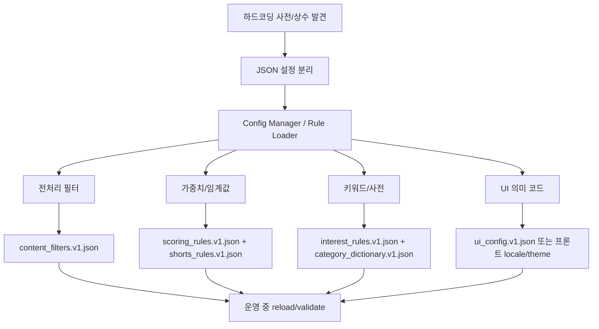

# Unbelievable 하드코딩/리팩토링 정밀 감사 보고서

작성일: 2026-06-14
대상: `projects/unbelievable`
범위: `backend/app/core`, `backend/app/services`, `backend/app/data`, `frontend/src`

## 1. 총평

현재 리팩토링 완성도는 **65/100** 정도로 판단된다.

좋은 점은 분명하다. 점수 규칙, 페르소나, 경고 메시지, 미션, 일부 카테고리 사전은 JSON 로더 구조로 분리되어 있고, 업로드/분석/대시보드 파이프라인도 서비스 계층으로 어느 정도 나뉘었다. 광고 제거, 검색어 추출, 숏츠/일반 영상 분리, 관심사 맵 API도 실제로 연결되어 있다.

하지만 "하드코딩 제거 완료" 상태는 아니다. 특히 **카테고리 분류 엔진이 여러 군데에 중복 존재**하고, **숏츠 분석 가중치**, **광고/검색 노이즈 필터**, **관심사 맵 규칙**, **대시보드 라벨/스타일**, **프론트 fallback 계산**이 코드 내부에 남아 있다. 따라서 지금 단계는 "기본 외부화 1차 완료 + 핵심 규칙 엔진 미완성"으로 보는 것이 정확하다.

## 2. 받은 외부 의견과 실제 코드 대조

| 항목 | 판정 | 근거 |
| --- | --- | --- |
| `TakeoutParser`/`features.py`/`scoring.py` 관심사 분리 | 부분 맞음 | `features.py`, `scoring.py`, `upload_service.py`, `dashboard_service.py`로 역할은 나뉘었지만, 분류 규칙은 `local_category_screening.py`, `category_classifier.py`, `interest_maps.py`, `category_loader.py`에 중복됨 |
| Loader 패턴 도입 | 맞음 | `scoring_rule_loader.py`, `category_loader.py`, `persona_loader.py`, `message_loader.py`, `mission_loader.py` 존재 |
| 주요 규칙 JSON 외부화 | 부분 맞음 | `scoring_rules.v1.json`, `category_dictionary.v1.json`, `warning_messages.ko.v1.json`, `detox_missions.v1.json` 존재. 단, 숏츠/광고/관심사맵/텍스트 정제 규칙은 코드 내부 |
| fallback 방어 | 맞음 | 각 loader에 `FALLBACK_*` 존재. 서버 구동 안정성은 좋지만 fallback 자체도 코드 하드코딩 |
| 프론트 API 계약 안정화 | 부분 맞음 | 대시보드는 API 데이터를 많이 쓰지만 `page.tsx`에 축 라벨, UI 색상, fallback DSAO 계산, 관심사 그래프 색상 등이 남아 있음 |

## 3. 실제로 잘 된 부분

1. **점수 규칙 외부화**
   - `backend/app/core/score_config.py`가 `scoring_rule_loader`를 통해 `scoring_rules.v1.json`을 참조한다.
   - `UAS_WEIGHTS`, `SMS_WEIGHTS`, `VOS_WEIGHTS`, `CLASSIFICATION_THRESHOLDS`, `MIN_DATA_REQUIREMENTS` 등 핵심 6축 점수 일부는 코드에서 직접 선언하지 않는다.

2. **사전/페르소나/미션/메시지 로더 구조**
   - `category_loader.py`는 `category_dictionary.v1.json`, `stop_words.v1.json`, `unstable_words.v1.json`, `stimulus_words.v1.json`, `youtube_category_map.v1.json`을 로드한다.
   - `persona_loader.py`, `mission_loader.py`, `message_loader.py`도 JSON 기반으로 바뀌었다.

3. **광고 제외와 검색어 추출의 공통 필터화**
   - `content_filters.py`에 `is_google_ad_event`, `detect_ad_event_reason`, `extract_search_query`, `detect_content_format` 계열 로직이 모였다.
   - 업로드 서비스와 관심사 맵에서 이를 재사용한다.

4. **관심사 맵/비교 리포트 API 연결**
   - `interest_maps.py`에 `build_search_interest_map`, `build_standard_video_interest_map`, `build_shorts_interest_map`, `build_interest_gap_report`가 존재한다.
   - `dashboard_service.py`에서 `insights.search_interest_map`, `standard_video_interest_map`, `shorts_interest_map`, `interest_gap_report`로 응답에 붙인다.

5. **프론트 안전 렌더링 개선**
   - `dashboard/page.tsx`는 새 관심사 맵 데이터를 optional/default 형태로 받고 있으며, 최근 수정으로 그래프 우선 UI와 접힘 상세 섹션이 들어갔다.

## 4. 중요한 부족점

### P0. 카테고리/관심사 분류 규칙이 4곳으로 쪼개져 있음

현재 분류 규칙의 출처가 하나가 아니다.

- `backend/app/core/category_loader.py`
  - JSON 기반 사전 로더.
  - 단, `FALLBACK_CATEGORY_DICT`, `FALLBACK_STOP_WORDS`, `FALLBACK_UNSTABLE_WORDS`, `FALLBACK_STIMULUS_WORDS`, `FALLBACK_YOUTUBE_CATEGORY_MAP`은 코드 내부.
- `backend/app/core/local_category_screening.py`
  - `CATEGORY_KEYWORDS`가 통째로 코드 하드코딩.
  - 실제로 `analysis_service.py`와 `features.py`에서 사용 중이라 죽은 코드가 아니다.
- `backend/app/core/category_classifier.py`
  - `map_topic_category_url`, `map_gcp_category_to_local`의 if/elif 매핑이 코드 내부.
  - GCP/YouTube 메타 카테고리 대응을 코드 수정 없이 바꾸기 어렵다.
- `backend/app/core/interest_maps.py`
  - `INTEREST_RULES`, `RAW_CATEGORY_MAP`, `YOUTUBE_CATEGORY_MAP`, `STYLE_KEYWORDS`, `BROAD_KEYWORDS`가 코드 내부.
  - 검색/시청/숏츠 맵의 미분류 문제에 가장 직접적으로 연결된다.

이 구조에서는 Gemini API를 붙여도 미분류가 완전히 해결되지 않는다. Gemini는 보조 분류기로 도움이 되지만, 서비스 대분류/소분류의 최종 기준은 여전히 여러 하드코딩 규칙에 흩어져 있기 때문이다.

### P0. 숏츠 분석 임계값/가중치가 코드 내부에 고정

대상: `backend/app/core/shorts_analysis.py`

잔존 상수:
- `SHORTS_LOOP_GAP_SEC = 180`
- `MEANINGFUL_LOOP_MIN_COUNT = 5`
- `HIGH_LOOP_MIN_COUNT = 10`
- `TIME_BUCKETS`
- `STOPWORDS`

잔존 수식:
- `repeated_topic_score = repeated_keyword_count * 12.0`
- `dopamine_loop_score = meaningful_loops * 15.0 + max_loop_length * 2.0 + duration * 1.5`
- `passive_feed_score = shorts_ratio * 35.0 + dopamine * 0.35 + repeated * 0.15 + time * 0.10 + passive bonus`
- `shorts_stimulation_risk = dopamine * 0.35 + repeated * 0.25 + time * 0.20 + passive * 0.20`
- `build_overall_risk`: 숏츠 수 20개 미만 0.10, 20개 이상 0.30

이 값들은 향후 사용자 피드백으로 가장 자주 튜닝될 부분이다. 반드시 `shorts_rules.v1.json` 같은 설정으로 빼는 것이 좋다.

### P0. 광고/프로모션 필터도 구현은 됐지만 설정화는 안 됨

대상: `backend/app/core/content_filters.py`

코드 상수:
- `AD_DETAIL_MARKERS`
- `AD_URL_MARKERS`
- `AD_TEXT_MARKERS`
- `PROMO_QUERY_PATTERNS`
- `SEARCH_PREFIXES`
- `SEARCH_TEXT_PATTERNS`
- `LOW_VALUE_SEARCH_EXACT`

현재 광고 제거가 계속 문제 되는 이유도 여기에 있다. 마커를 추가하려면 코드 수정이 필요하고, 광고/검색어 노이즈 기준이 테스트 데이터에 맞춰 빠르게 확장되기 어렵다.

### P1. 감정 균형 점수의 키워드가 이중화됨

대상: `backend/app/core/scoring.py`

`category_loader.py`에는 이미 `stimulus_words.v1.json` 로더가 있는데, `scoring.py`의 EBS 계산부에는 별도 배열이 남아 있다.

- `stimulus_keywords = ["충격", "폭로", ...]`
- `calm_keywords = ["asmr", "명상", ...]`

즉, `stimulus_words.v1.json`을 수정해도 EBS의 실제 자극/안정 키워드 판정에는 반영되지 않는 경로가 남아 있다. 이건 외부화가 완료된 것처럼 보이지만 실제 운영 튜닝에서는 누락을 만들 수 있다.

### P1. 텍스트 정제 규칙이 코드 내부에 고정

대상: `backend/app/core/text_cleaning.py`, `backend/app/core/category_dictionary.py`

잔존 규칙:
- 조사 제거 리스트: `은`, `는`, `이`, `가`, `을`, `를`, ...
- 도메인/URL 노이즈 리스트: `.com`, `.net`, `.org`, `http`, `www`, `youtube`, `co.kr`
- 회차/분량 접미사 정규식: `^\d+[화회부편탄분초]$`
- `ALLOWED_2LETTER_ENG = {"AI", "IT", ...}`
- `DATE_PATTERN`

이 영역은 당장 장애를 만들지는 않지만 검색어 맵의 품질과 미분류 비율에 영향을 준다.

### P1. Java SDK 경로가 Windows 절대 경로로 박혀 있음

대상: `backend/app/core/nlp_enhanced.py`

현재:

```python
java_home = os.environ.get("JAVA_HOME", r"C:\Program Files\Eclipse Adoptium\jdk-17.0.18.8-hotspot")
```

다른 개발자 PC나 Linux 배포 환경에서는 맞지 않는 기본값이다. `JAVA_HOME_FALLBACK` 또는 `.env` 설정으로 분리하는 것이 맞다.

### P1. 대시보드 서비스가 UI 표현을 일부 소유

대상: `backend/app/services/dashboard_service.py`

잔존 하드코딩:
- `AXIS_NAMES`
- `INSIGHT_TONES = ["bg-rose-500", "bg-emerald-500", ...]`
- `report_insights` 문장 템플릿
- `behavioral_patterns` 문장 템플릿
- DSAO 판정 기준의 `50.0`, 롱폼 기준 `180초`

백엔드가 Tailwind 클래스를 반환하는 것은 계층 분리가 좋지 않다. 백엔드는 `tone: "danger"`, `tone: "success"` 같은 의미 코드만 주고, 색상은 프론트가 결정하는 편이 낫다.

### P1. 프론트에도 계산/표현 fallback이 남아 있음

대상: `frontend/src/app/dashboard/page.tsx`

잔존 예:
- `AXIS_LABELS`, `CONFIDENCE_LABELS`, `AXIS_UNAVAILABLE_REASON_LABELS`
- `riskSignals`, `INTEREST_GRAPH_COLORS`, `GRAPH_TONE_SURFACES`
- survey fallback 기반 DSAO 코드 계산: `uas >= 50`, `tds >= 50`, `sms >= 50`
- 그래프 표시용 중립 위치 `50점`

일부는 UI 표현이므로 프론트에 있어도 된다. 하지만 "계산 기준"에 가까운 fallback은 백엔드 응답으로 통일하는 편이 좋다.

### P2. Takeout 파서/업로드 제한값이 부분 외부화 상태

좋은 점:
- `backend/app/core/upload_config.py`에 ZIP/파서/기간 제한이 일부 외부화되어 있다.

남은 점:
- `backend/app/core/takeout_parser.py`에는 영문 월 매핑, 한/영 검색/시청 패턴, timestamp 파싱 규칙이 코드 내부에 있다.
- `frontend/src/app/upload/page.tsx`에는 파일 크기 `150 * 1024 * 1024`, 요청 timeout `60000`, UI 지연 `500ms` 등이 남아 있다.
- `upload_service.py`에는 timeline duration estimate에서 `1800`, `600` 같은 fallback 수치가 아직 직접 사용된다.

## 5. 이전 문서와 충돌하는 부분

`docs/refactoring-hardcoding.md`는 "하드코딩 외부화 완료"라고 적고 있지만 현재 코드 기준으로는 사실과 다르다.

수정 권장:
- 해당 문서는 "2차 작업 당시 목표/성과" 문서로 남기되, 맨 위에 "현재 기준으로는 일부 내용이 낙관적이며 최신 감사 문서를 우선 참고"라는 경고를 추가한다.
- 최신 기준 문서는 이 파일(`hardcoding-audit-2026-06-14.md`)을 기준으로 삼는다.

## 6. 추천 리팩토링 순서

### 1단계: 분류 규칙 단일화

목표:
- `local_category_screening.py`, `category_classifier.py`, `interest_maps.py`에 흩어진 카테고리/관심사 규칙을 하나의 loader로 통합.

추천 파일:
- `backend/app/data/rules/interest_rules.v1.json`
- `backend/app/core/interest_rule_loader.py`

우선 이동 대상:
- `INTEREST_RULES`
- `RAW_CATEGORY_MAP`
- `YOUTUBE_CATEGORY_MAP`
- `STYLE_KEYWORDS`
- `BROAD_KEYWORDS`
- `CATEGORY_KEYWORDS`

### 2단계: 광고/검색어 필터 설정화

목표:
- 광고 제거와 검색어 정제를 운영 중 빠르게 조정 가능하게 만든다.

추천 파일:
- `backend/app/data/rules/content_filters.v1.json`

우선 이동 대상:
- `AD_DETAIL_MARKERS`
- `AD_URL_MARKERS`
- `AD_TEXT_MARKERS`
- `PROMO_QUERY_PATTERNS`
- `SEARCH_PREFIXES`
- `LOW_VALUE_SEARCH_EXACT`

### 3단계: 숏츠 분석 규칙 설정화

추천 파일:
- `backend/app/data/rules/shorts_rules.v1.json`

우선 이동 대상:
- 루프 간격
- 의미 있는 루프 최소 개수
- 시간대 bucket
- 반복 키워드 점수 가중치
- dopamine/passive/stimulation/final risk 가중치

### 4단계: UI 표현 코드 분리

목표:
- 백엔드는 의미 코드만 반환.
- 프론트는 색상/라벨/배지/문구를 담당.

예:
- 백엔드: `tone: "danger"`
- 프론트: `"danger" -> "bg-rose-500"`

### 5단계: 설정 리로드/검증 체계

즉시 핫리로드까지는 과하다. 먼저 아래를 추천한다.

1. `/api/v1/admin/config/validate`
2. `/api/v1/admin/config/reload`
3. JSON schema 검증
4. 로더별 `version`, `loaded_at`, `source`, `fallback_used` 노출

## 7. 권장 구조



## 8. 결론

받은 의견은 방향성은 맞다. 다만 실제 코드 기준으로는 이미 JSON화된 부분과 아직 코드에 남은 부분이 섞여 있으므로, "전체 하드코딩 제거 완료"가 아니라 **"핵심 설정 외부화는 시작됐지만, 분류/필터/숏츠/UI 설정은 아직 미완성"**이라고 정리해야 한다.

가장 먼저 해야 할 일은 Gemini API 적용이 아니라 **관심사 분류 규칙의 단일화**다. Gemini는 미분류를 줄이는 데 도움은 되지만, 현재처럼 로컬 규칙이 4곳에 흩어져 있으면 Gemini 결과를 어디에 반영할지도 계속 흔들린다.

