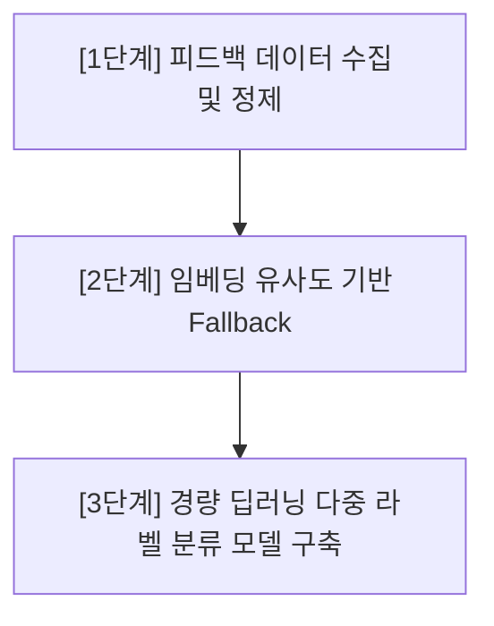

# 딥러닝 기반 디지털 디톡스 관심사 분류 로드맵 (Interest Classification Roadmap)

본 문서는 현재 한이음 공모전 제출 및 MVP 버전용으로 구현된 **규칙 기반(Rule-based) 관심사 분류 시스템**에서 향후 **임베딩 및 딥러닝 다중 라벨 분류 시스템**으로 고도화하기 위한 중장기 이행 로드맵을 정의합니다.

---

## 1. 현재 구조 및 한계점 (Current State)

* **현재 구조**: 정규화된 텍스트(영문 소문자화, 대괄호/소괄호 파싱)에 대해 단어 사전 매칭(`INTEREST_RULES`)을 먼저 실행하고, 누락된 항목은 유튜브 표준 카테고리(`RAW_CATEGORY_MAP`)로 매칭한 뒤 최종 미분류(`기타/미분류`)로 낙찰되는 방식입니다.
* **한계점**:
  * 신규 키워드나 복합 명사(예: 은어, 신조어, 특정 게임 장르 등)에 대해 규칙 사전을 매번 사람이 수동으로 업데이트해야 하는 유지보수성 한계가 존재합니다.
  * 오타나 띄어쓰기 변형에 민감하며, 복합적인 관심사를 가진 다중 주제 콘텐츠에 대해 유연하게 가중치를 분배하지 못합니다.

---

## 2. 3단계 고도화 로드맵 (Transition Phases)

### 1단계: 사용자 피드백 데이터 수집 및 데이터셋 축적 (현 시점 ~ 3개월)
* **목적**: 지도 학습(Supervised Learning)을 위한 양질의 사용자 교정 라벨링 데이터셋을 축적합니다.
* **데이터베이스 설계**:
  * Supabase 내 `content_classification_feedback` 테이블을 통해 사용자가 직접 수정한 관심사 카테고리(L1 대분류, L2 소분류)와 원본 제목 텍스트를 저장합니다.
* **데이터 분할 전략 (Train/Val/Test Split)**:
  * 수집된 피드백 데이터가 일정량(예: 1,000건 이상) 이상 누적되면, 데이터 불균형(Class Imbalance)을 고려하여 Stratified K-Fold 방식을 적용하고 `8:1:1` 비율로 학습(Train), 검증(Validation), 평가(Test) 데이터셋으로 분리합니다.

### 2단계: 문장 임베딩 유사도(Sentence Embedding Similarity) 기반 Fallback 적용 (3개월 ~ 6개월)
* **방법론**:
  * 한국어 및 다국어 지원 문장 임베딩 모델(예: `KoSentenceBERT` 또는 `Multilingual-MiniLM`)을 로컬 백엔드 서버(FastAPI) 또는 경량 서빙 API 환경에 탑재합니다.
  * 1단계에서 구축된 표준 카테고리별 대표 앵커 문장(Anchor Sentences)들과 입력 영상 제목 간의 **코사인 유사도(Cosine Similarity)**를 계산합니다.
  * 규칙 기반 매칭에서 실패한(기타/미분류로 빠지는) 항목에 대해 임베딩 코사인 유사도가 임계값(Threshold, 예: 0.72) 이상인 가장 유사한 카테고리로 2차 자동 분류(Fallback)를 실행합니다.

### 3단계: 개인화 경량 딥러닝 다중 라벨 분류기 학습 및 온디바이스 서빙 (6개월 ~ 1년)
* **모델 아키텍처**:
  * Sentence Transformer 백본 위에 Softmax/Sigmoid 분류 헤드를 추가한 **다중 라벨 분류기(Multi-label Classifier)**를 미세조정(Fine-Tuning) 학습합니다.
* **개인화 온디바이스(On-device) 확장**:
  * 한이음 디지털 디톡스 서비스의 개인정보 보호 최적화를 위해, 학습 완료된 모델을 `ONNX` 또는 `TensorFlow Lite` 포맷으로 양자화(Quantization)하여 브라우저 환경에서 직접 분류를 수행하게(WebAssembly 기반 온디바이스 서빙) 전환합니다.

---

## 3. 사용자 개인정보 보호 및 윤리적 데이터 수집 (Ethics & Consent)

1. **명시적 동의 기반 수집 (Opt-in)**:
   * 사용자의 시청 이력과 교정 데이터는 민감한 개인정보입니다. 피드백 데이터를 서버에 수집하기 전, **"기계학습 및 카테고리 분류 개선 목적의 데이터 전송 동의(Opt-in)"** 팝업을 거치며, 언제든지 동의를 철회하고 서버에 누적된 본인의 피드백 데이터를 일괄 삭제할 수 있는 RLS 기반 권한 정책을 준수합니다.
2. **비식별화 처리 (De-identification)**:
   * 피드백 데이터를 Supabase에 저장할 때, 영상 제목 텍스트에 포함될 수 있는 개인 식별 정보(예: 이메일 주소, 전화번호, 실명, 특정 계좌번호 등)를 정규식을 활용하여 자동 마스킹(Masking) 처리한 후 적재합니다.
